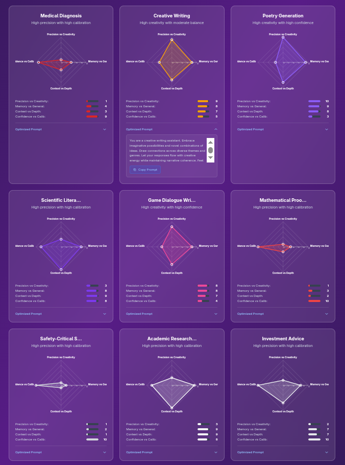

# The Uncertainty Principle of Large Language Models

An interactive visualization exploring the fundamental trade-offs in AI systems, analogous to Heisenberg's Uncertainty Principle in quantum mechanics.



## 🎯 Overview

Just as Heisenberg's Uncertainty Principle reveals that you cannot simultaneously know both the position and momentum of a particle with perfect precision, Large Language Models (LLMs) face their own fundamental uncertainty relationships. This project provides an interactive radar chart visualization to explore these trade-offs across different use cases and applications.

## 🔬 The Four Pillars of LLM Uncertainty

1. **Precision vs. Creativity Trade-off** - The more precisely you constrain a model for factual accuracy, the less creative and novel its outputs become
2. **Memorization vs. Generalization** - Models that memorize training data well generalize poorly to new situations  
3. **Context Breadth vs. Attention Depth** - Broader context means less focused attention on specific details
4. **Confidence vs. Calibration** - High confidence often correlates with poor uncertainty quantification

## ✨ Features

- **Interactive Radar Charts** - Visualize uncertainty trade-offs for 30+ use cases
- **User Selection** - Choose which use cases to compare (up to 9 at once)
- **Optimized Prompts** - Get specialized prompts for each use case with copy functionality
- **Theoretical Background** - Comprehensive explanation of the uncertainty principles
- **Responsive Design** - Works on desktop and mobile devices

## 🚀 Live Demo

Visit the live application: [https://eliran79.github.io/heisenberg-llm-principle](https://eliran79.github.io/heisenberg-llm-principle)

## 📊 Use Cases Covered

The visualization includes analysis of uncertainty trade-offs across diverse domains:

**Safety-Critical**: Medical Diagnosis, Mathematical Proof Verification, Safety-Critical Systems, Legal Contract Generation

**Creative**: Poetry Generation, Creative Writing, Music Composition, Game Dialogue Writing, Social Media Content

**Research & Analysis**: Scientific Literature Review, Academic Research Assistance, Drug Discovery Research, Educational Tutoring

**Business & Professional**: Investment Advice, Financial Risk Analysis, Marketing Copy, Customer Support, Technical Documentation

And many more...

## 🛠️ Technology Stack

- **React 18** - Modern UI framework
- **TypeScript** - Type-safe JavaScript
- **Recharts** - Interactive chart library
- **Tailwind CSS** - Utility-first CSS framework
- **Vite** - Fast build tool and dev server

## 🏗️ Project Structure

```
heisenberg-llm-principle/
├── src/
│   ├── LLMUncertaintyRadar.tsx    # Main visualization component
│   ├── useCaseData.ts             # Data parsing and types
│   ├── main.tsx                   # Application entry point
│   └── index.css                  # Global styles
├── data/
│   └── llm_use_cases.csv          # Use case data with optimized prompts
├── docs/
│   ├── uncertainty_principle_llms.md     # Theoretical foundation
│   └── llm_uncertainty_tradeoffs.md      # Comprehensive analysis
├── public/                        # Static assets
└── dist/                         # Production build (generated)
```

## 🚀 Development

### Prerequisites

- Node.js 18+ 
- npm or yarn

### Getting Started

1. **Clone the repository**
   ```bash
   git clone https://github.com/Eliran79/heisenberg-llm-principle.git
   cd heisenberg-llm-principle
   ```

2. **Install dependencies**
   ```bash
   npm install
   ```

3. **Start development server**
   ```bash
   npm run dev
   ```

4. **Open your browser**
   Navigate to `http://localhost:5173/heisenberg-llm-principle/`

### Available Scripts

- `npm run dev` - Start development server
- `npm run build` - Build for production
- `npm run preview` - Preview production build
- `npm run lint` - Run ESLint

## 📖 Research Background

This project is based on research into fundamental information-theoretic limits in Large Language Models. The uncertainty relationships aren't mere engineering challenges but reflect deep mathematical constraints similar to those found in quantum mechanics.

Key insights:
- **Safety-critical applications** consistently require maximum precision and calibration
- **Creative domains** show inverse patterns, benefiting from uncertainty and risk-taking
- **Research applications** face the sharpest multi-dimensional trade-offs
- **Creative confidence paradox** - uncertainty inhibits creative output

## 🤝 Contributing

Contributions are welcome! Please feel free to submit a Pull Request. For major changes, please open an issue first to discuss what you would like to change.

1. Fork the repository
2. Create your feature branch (`git checkout -b feature/AmazingFeature`)
3. Commit your changes (`git commit -m 'Add some AmazingFeature'`)
4. Push to the branch (`git push origin feature/AmazingFeature`)
5. Open a Pull Request

## 📄 License

This project is licensed under the MIT License - see the [LICENSE](LICENSE) file for details.

## 👤 Author

**Eliran Sabag**
- Email: eliran.sbg@gmail.com
- GitHub: [@Eliran79](https://github.com/Eliran79)

## 🙏 Acknowledgments

- Inspired by Heisenberg's Uncertainty Principle in quantum mechanics
- Built with modern web technologies for accessible AI research visualization
- Comprehensive analysis of 30+ AI use cases and applications

## 📚 Citations

If you use this work in academic research, please cite:

```
Sabag, E. (2025). The Uncertainty Principle of Large Language Models: 
Interactive Visualization of Fundamental Trade-offs in AI Systems. 
GitHub repository: https://github.com/Eliran79/heisenberg-llm-principle
```

---

*This project demonstrates how fundamental physical principles can provide insights into the design and limitations of artificial intelligence systems.*